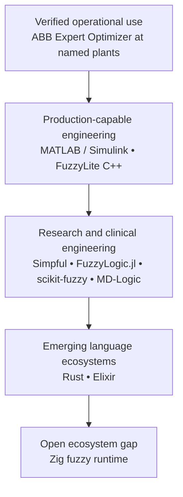
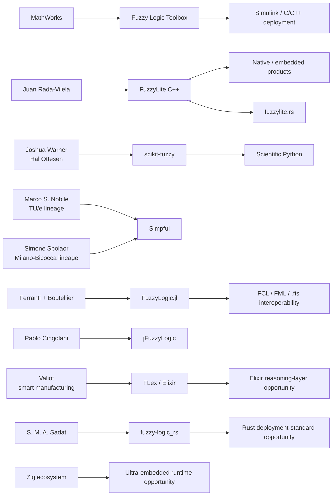
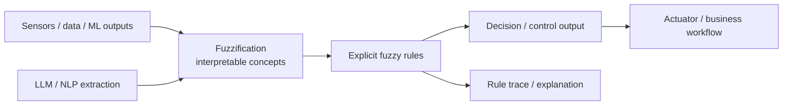
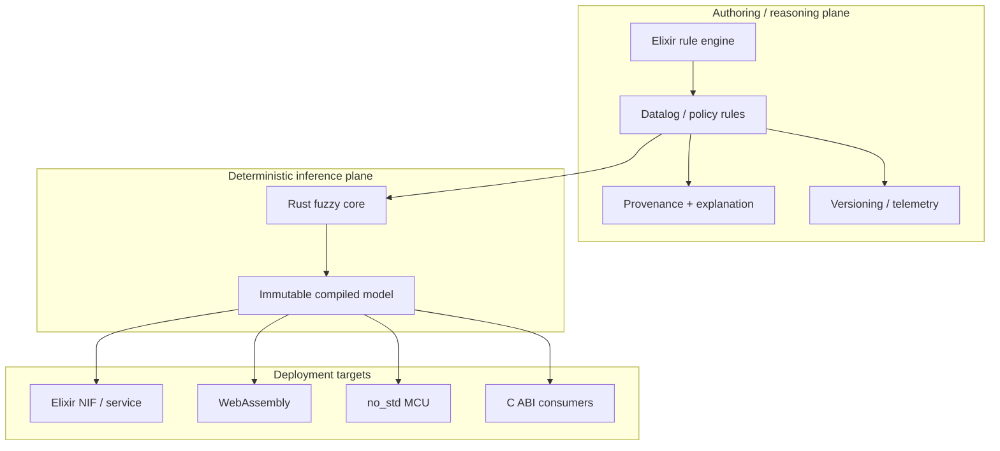
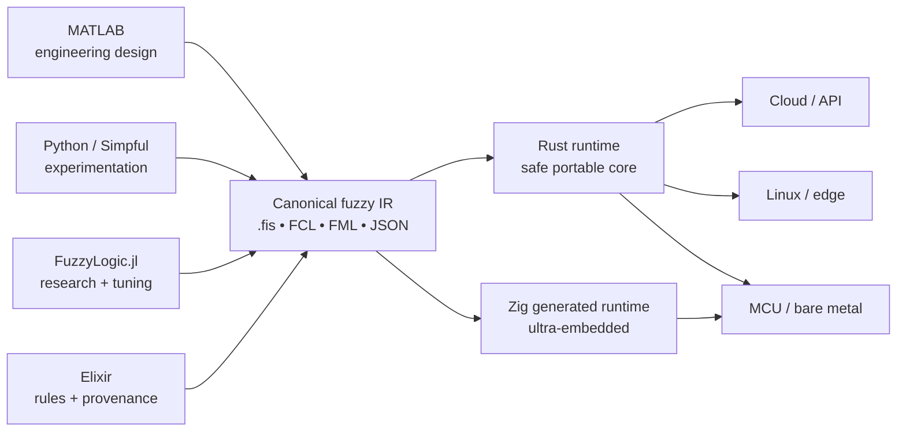

This is part 3 of [Fuzzy Logic](https://thanos.github.io/series/fuzzy-logic/).

# Fuzzy Logic in 2026: Who Is Using It, What Is Actually Deployed, and Where the Ecosystem Is Going


## Executive summary

Fuzzy logic is not a dead technology. In 2026 it occupies a narrower but durable niche than the “fuzzy everything” enthusiasm of the 1980s and 1990s: **low-dimensional control, industrial process optimization, embedded decision systems, clinically evaluated dosing/control algorithms, and engineering systems in which domain experts can state useful linguistic rules but a first-principles model is incomplete or cumbersome**. The strongest evidence of current commercial deployment is not in popular open-source packages; it is in proprietary industrial control systems. ABB, for example, explicitly documents fuzzy logic inside its Advanced Process Control technology and its **ABB Ability Expert Optimizer**, with named operating deployments at Tokuyama’s Nanyo cement plant and SCA’s Östrand pulp mill. At Tokuyama, ABB says Expert Optimizer combines fuzzy logic with model-predictive and sequential logic and reports a 3% reduction in kiln thermal energy and roughly 70% reduction in manual tasks.

The second major finding is that **library popularity and production deployment are only weakly correlated**. MATLAB’s [Fuzzy Logic Toolbox](https://www.mathworks.com/products/fuzzy-logic.html), C++ [FuzzyLite](https://github.com/fuzzylite/fuzzylite), Python [scikit-fuzzy](https://github.com/scikit-fuzzy/scikit-fuzzy) and [Simpful](https://github.com/aresio/simpful), Julia [FuzzyLogic.jl](https://github.com/lucaferranti/FuzzyLogic.jl), and Java [jFuzzyLogic](https://github.com/pcingola/jFuzzyLogic) provide substantial engineering or research capability. But companies rarely disclose that an embedded firmware image contains `fuzzylite`, a `.fis` model, or a custom Mamdani engine. Conversely, a vendor such as ABB can openly document fuzzy inference in a deployed product while using its own proprietary implementation rather than any of the popular public libraries.

Among open-source systems, **FuzzyLite is the most deployment-oriented general-purpose implementation** in this survey. Its current C++library supports Mamdani, Takagi-Sugeno, Larsen, Tsukamoto, inverse Tsukamoto and hybrid controllers; imports FLL, MATLAB FIS and IEC-style FCL; exports multiple formats including C++ and Java; and is designed for static or dynamic linking. It is dual-licensed GPLv3/commercial. That combination is much closer to an embedded/product runtime than the typical scientific Python package.

**MATLAB remains the strongest commercial design-to-deployment environment.** Current MathWorks documentation covers type-1 and type-2 Mamdani/Sugeno systems, data-driven FIS generation and tuning, Simulink execution, and C/C++ code-generation paths through Simulink Coder/MATLAB Coder. That matters more for industrial adoption than the elegance of the underlying fuzzy API: an engineer can design, simulate, validate and then generate deployable code inside an established controls workflow.

**Python and Julia dominate the transparent research/prototyping side.** scikit-fuzzy is a SciPy-oriented fuzzy toolkit; Simpful emphasizes natural-language-like Mamdani and arbitrary-order Sugeno rule systems; FuzzyLogic.jl combines Mamdani/Sugeno, type-1/type-2 inference, a Julia DSL and interoperability with FCL, IEEE 1855 Fuzzy Markup Language and MATLAB `.fis`. Simpful originated with researchers at Eindhoven University of Technology and the University of Milano-Bicocca; FuzzyLogic.jl was described in an IEEE FUZZ 2023 paper by Luca Ferranti and Jani Boutellier.

**Rust has a genuine ecosystem opportunity.** There are multiple small fuzzy projects but no obvious de facto standard comparable with FuzzyLite or scikit-fuzzy. `fuzzy-logic_rs` currently implements type-1 Mamdani and type-1 TSK while listing type-2, interchange, ANFIS, control-specific facilities and clustering as unfinished work; its manifest describes an MIT-licensed, dependency-free Rust package with speed-control and function-approximation examples. FuzzyLite itself also has an embryonic Rust repository.

**Elixir is different.** Valiot’s [FLex](https://github.com/valiot/flex) already implements Mamdani, Takagi-Sugeno and ANFIS concepts and is maintained under the GitHub organization of an industrial AI/smart-manufacturing company. Its package metadata names `valiot` as maintainer. That is meaningful industrial provenance, but I found no primary evidence that Valiot currently runs FLex inside one of its commercial manufacturing products, so it should not be labeled a verified production deployment.

**Zig is almost an open field.** The search conducted for this report did not surface an established Zig fuzzy-inference engine comparable to the libraries above. That is not proof that no private or obscure implementation exists, but it is enough to identify a real ecosystem gap. The most compelling Zig niche is not another large desktop fuzzy framework; it is an allocator-free, generated-code or compact-table runtime for very small embedded targets. The existing Zig package ecosystem provides distribution infrastructure, but no fuzzy package emerged as a recognized standard in this survey.

The sector picture is uneven:


| Sector                       | Strength of current public evidence                                        | What the evidence actually shows                                                                                                                                                               |
| ---------------------------- | -------------------------------------------------------------------------- | ---------------------------------------------------------------------------------------------------------------------------------------------------------------------------------------------- |
| Industrial process control   | **Very strong**                                                            | Named operating plants and explicit fuzzy-control products from ABB.                                                                                                                           |
| Embedded/control engineering | **Strong toolchain evidence**                                              | MATLAB code generation and FuzzyLite are directly suited to compiled controller deployment; public end-customer disclosure is less common.                                                     |
| Healthcare                   | **Strong research/clinical and patent evidence**                           | MD-Logic artificial-pancreas work and newer insulin-control patents explicitly use fuzzy control; exact algorithms in current commercial pumps are often proprietary.                          |
| HVAC/buildings               | **Moderate**                                                               | Continuing engineering research using MATLAB fuzzy controllers; less convincing evidence of disclosed contemporary commercial implementations.                                                 |
| ML/XAI                       | **Moderate research/tooling evidence**                                     | Fuzzy systems remain attractive as interpretable rule models and can be learned/tuned from data, but named enterprise XAI deployments are poorly disclosed.                                    |
| Automotive                   | **Weak public evidence under a strict standard**                           | The engineering toolchain is relevant, but this survey did not find a sufficiently strong current OEM source naming a deployed fuzzy implementation.                                           |
| Finance                      | **Weak public production evidence**                                        | Research possibilities are plentiful, but I did not find a current major financial institution publicly identifying one of these fuzzy engines in a production credit, fraud or trading stack. |
| Robotics                     | **Moderate research/prototyping evidence, weak named commercial evidence** | Fuzzy control remains technically natural for navigation and actuator policies, but public product disclosures are sparse. FuzzyLite itself ships obstacle-avoidance examples.                 |


The strategic conclusion is therefore more nuanced than “fuzzy logic is still popular.” **Fuzzy logic remains deployed where its engineering properties fit, but it has become infrastructure rather than a fashionable AI category.** Its most defensible strengths in 2026 are deterministic computation, readable rules, graceful transitions between qualitative regimes, small data requirements, and straightforward runtime implementations. The most interesting new work would connect those properties to modern systems languages, provenance-aware rule engines and ML/LLM interfaces rather than rebuilding 1995-era fuzzy-control packages unchanged.

## How I separated deployed use from library visibility

A difficulty with researching fuzzy logic is that the phrase **“uses fuzzy logic” covers four very different levels of evidence**. A paper implementing a simulated controller, an open-source library with thousands of installs, a commercial engineering environment that can generate controller code, and a factory actually running a fuzzy controller are not equivalent.

For this report I use the following evidence model:


| Grade                                           | Meaning                                                                                                                                      | Representative evidence                                                        |
| ----------------------------------------------- | -------------------------------------------------------------------------------------------------------------------------------------------- | ------------------------------------------------------------------------------ |
| **A — verified operational deployment**         | A named organization/product/site is explicitly documented as operating fuzzy logic in a real system.                                        | ABB Expert Optimizer at Tokuyama and SCA.                                      |
| **B — production-capable implementation**       | The implementation has an explicit compiled/embedded/commercial deployment path, but a specific current customer is not publicly tied to it. | MATLAB/Simulink code generation; FuzzyLite C++ static/dynamic linking.         |
| **C — validated research/clinical engineering** | A peer-reviewed system was implemented and tested, possibly with humans or real process data, but commercial operation is not established.   | MD-Logic clinical artificial-pancreas research; MATLAB HVAC studies.           |
| **D — ecosystem/package evidence**              | A library exists and is maintained/distributed, but there is no public evidence that a named organization operates it in production.         | scikit-fuzzy, many Rust crates, FLex absent a disclosed commercial deployment. |


That distinction prevents a common analytical error: **GitHub stars, downloads and citations measure visibility, not installed industrial base.** A proprietary fuzzy controller inside a cement kiln can have zero GitHub stars while being economically significant; conversely, a scientific package can be widely downloaded without ever sitting in a hard-real-time loop.

This also creates a disclosure bias. Industrial-control vendors have commercial reasons to describe *capabilities* but not necessarily source code; embedded-product companies frequently do not disclose controller internals at all. Open-source projects are maximally visible, making them easy to count but potentially misleading as a proxy for economic adoption.

The ecosystem consequently looks like a funnel rather than a single leaderboard:




The important point is that this is an **evidence hierarchy, not a quality ranking**. MATLAB and FuzzyLite may underpin deployments that are not publicly attributable; Simpful and FuzzyLogic.jl can be technically excellent without being industrial runtime standards; and a small Rust project can be architecturally promising without yet having adoption evidence.

## Organizations and implementations in use

The following table separates **who is demonstrably operating fuzzy logic** from **who develops or maintains an implementation that others can deploy**.


| Organization / institution                                                             | Fuzzy implementation                                                                                   | Evidence, source and contributor/employer connection                                                                                                                                                                                                                                                                                                             | Application domain                                                           | Deployment type                                                | Evidence grade                                     |
| -------------------------------------------------------------------------------------- | ------------------------------------------------------------------------------------------------------ | ---------------------------------------------------------------------------------------------------------------------------------------------------------------------------------------------------------------------------------------------------------------------------------------------------------------------------------------------------------------- | ---------------------------------------------------------------------------- | -------------------------------------------------------------- | -------------------------------------------------- |
| **Tokuyama Corp., Nanyo cement plant**                                                 | ABB Ability Expert Optimizer; proprietary ABB APC using fuzzy logic alongside MPC and sequential logic | [ABB Tokuyama case study](https://new.abb.com/industrial-software/case-studies/tokuyama-cement-plant-uses-abb-industrial-software-to-reduce-energy-consumption). ABB explicitly describes Expert Optimizer and reports operating results.                                                                                                                        | Cement kiln/calciner/cooler process optimization                             | **Production industrial control**                              | **A**                                              |
| **SCA, Östrand pulp mill**                                                             | ABB Ability Expert Optimizer                                                                           | ABB's SCA case describes Expert Optimizer applying fuzzy logic and MPC to process control, including oxygen/bleaching processes.                                                                                                                                                                                                                                 | Pulp and paper / advanced process control                                    | **Production industrial control**                              | **A**                                              |
| **ABB**                                                                                | ABB APC fuzzy-control libraries and Expert Optimizer                                                   | ABB's [APC technology](https://new.abb.com/industrial-software/process-performance/apc-advanced-process-control/apc-technology) explicitly describes a fuzzy-logic control-system library; its process-performance offering combines fuzzy logic and MPC and supports industrial deployment configurations including on-premises and managed/cloud environments. | Cement, mining, metals, pulp/paper and other process industries              | Product; edge/process-control plus server/cloud management     | **A/B**                                            |
| **MathWorks and MATLAB/Simulink customers**                                            | MATLAB Fuzzy Logic Toolbox                                                                             | [Fuzzy Logic Toolbox](https://www.mathworks.com/products/fuzzy-logic.html) supports current Mamdani/Sugeno workflows; Simulink's Fuzzy Logic Controller participates in code-generation workflows. MathWorks is the commercial maintainer rather than an OSS contributor community.                                                                              | Controls, modeling, data-driven FIS design, embedded engineering             | Desktop design, simulation, generated embedded/compiled code   | **B**                                              |
| **FuzzyLite commercial/open-source users**                                             | [FuzzyLite](https://github.com/fuzzylite/fuzzylite) C++                                                | Created and maintained by **Juan Rada-Vilela, PhD**; GPLv3/commercial licensing, static/dynamic linking, six controller families, FIS/FCL/FLL import. Named customers are not publicly enumerated in the repository.                                                                                                                                             | General control, robotics, embedded/control applications                     | Native C++ library / product integration                       | **B**                                              |
| **MD-Logic artificial-pancreas researchers and clinical sites**                        | Custom MD-Logic fuzzy controller                                                                       | Peer-reviewed Diabetes Care work explicitly says the artificial-pancreas algorithm uses fuzzy logic to mimic caregiver reasoning; subsequent randomized research evaluated the system. A related patent describes fuzzy modules and insulin-delivery outputs.                                                                                                    | Diabetes / closed-loop insulin delivery                                      | Clinical research and medical-device algorithm                 | **C**, with real human operation                   |
| **Researchers developing newer insulin-delivery controllers**                          | Custom fuzzy dosing controller                                                                         | A recent U.S. insulin-control patent explicitly describes a controller employing fuzzy logic and rule matrices based on glucose level, rate and acceleration. A patent demonstrates protected engineering work, not necessarily market deployment.                                                                                                               | Diabetes / drug delivery                                                     | Patented device/control R&D                                    | **B/C**                                            |
| **HVAC research groups using MATLAB**                                                  | MATLAB Fuzzy Logic Toolbox, Mamdani FIS                                                                | A 2023 Applied Sciences HVAC study explicitly builds the FIS using MATLAB's toolbox and couples fuzzy control to building/energy simulation; the paper discusses IoT/RTOS-oriented implementation possibilities.                                                                                                                                                 | HVAC, comfort and energy control                                             | Simulation/research; potential edge implementation             | **C**                                              |
| **SciPy/scientific-Python community**                                                  | [scikit-fuzzy](https://github.com/scikit-fuzzy/scikit-fuzzy)                                           | Official project describes itself as a fuzzy-logic toolkit for SciPy and an open scientific alternative to closed-source systems. Contributor file identifies **Joshua Warner** for project coordination/Python translation and **Hal Ottesen** for the original MATLAB toolbox.                                                                                 | Research, fuzzy control, clustering, scientific computing                    | Python research/prototyping; possible application service use  | **C/D**                                            |
| **Eindhoven University of Technology / University of Milano-Bicocca research lineage** | [Simpful](https://github.com/aresio/simpful)                                                           | Repository states that **Marco S. Nobile** created it at Eindhoven University of Technology and **Simone Spolaor** at University of Milano-Bicocca; supports Mamdani and arbitrary-order Sugeno reasoning.                                                                                                                                                       | Explainable fuzzy rules, computational intelligence, scientific applications | Research/prototyping / Python service possible                 | **C**                                              |
| **Ferranti/Boutellier academic project and Julia users**                               | [FuzzyLogic.jl](https://github.com/lucaferranti/FuzzyLogic.jl)                                         | **Luca Ferranti** and **Jani Boutellier** authored the IEEE FUZZ 2023 library paper; repository supports Mamdani/Sugeno, type-1/type-2, FCL, FML and MATLAB FIS.                                                                                                                                                                                                 | Research, controls, portable/interoperable fuzzy models                      | Julia research/prototyping; compilable model code              | **C**                                              |
| **Java research/engineering community**                                                | [jFuzzyLogic](https://github.com/pcingola/jFuzzyLogic)                                                 | **Pablo Cingolani's** project describes itself as a Java fuzzy library for research/industrial applications and includes FCL-related tooling. The “de-facto standard” wording is the project's own characterization, not independently verified market-share evidence.                                                                                           | Java rule/control applications                                               | JVM application or research runtime                            | **C/D**                                            |
| **Valiot**                                                                             | [FLex](https://github.com/valiot/flex), Elixir                                                         | FLex repository carries Valiot branding; `mix.exs` identifies `valiot` as maintainer. The engine includes Mamdani, TSK and ANFIS facilities. Valiot itself is a smart-manufacturing AI software company. **No public source found here proves FLex is used inside Valiot's commercial products.**                                                                | Industrial/manufacturing-oriented fuzzy toolkit                              | Elixir library / industrial R&D; production status undisclosed | **D**, with unusually strong industrial provenance |
| **Seyed Mohammad Amin Sadat / Rust users**                                             | [fuzzy-logic-rs](https://github.com/MohammadAminSadat/fuzzy-logic-rs)                                  | Cargo metadata identifies **Seyed Mohammad Amin Sadat** as author; repository says type-1 Mamdani and TSK are implemented, while type-2, serialization/import/export, ANFIS and control modules remain roadmap items.                                                                                                                                            | Systems/embedded fuzzy inference experimentation                             | Rust package/prototyping                                       | **D**                                              |
| **FuzzyLite project**                                                                  | [fuzzylite.rs](https://github.com/fuzzylite/fuzzylite.rs)                                              | Official FuzzyLite organization contains a Rust repository, but it is far smaller and less developed than the C++ implementation.                                                                                                                                                                                                                                | Potential systems/embedded control                                           | Experimental Rust port                                         | **D**                                              |
| **Zig ecosystem**                                                                      | No established general fuzzy engine identified in this survey                                          | The Zig package ecosystem exists, but this research did not surface a recognized fuzzy-inference package comparable to the implementations above. [Zigistry](https://zigistry.dev/) is one available package index.                                                                                                                                              | Opportunity: highly constrained embedded control                             | Gap / opportunity                                              | —                                                  |


A notable pattern emerges from this table: **the organizations with the clearest current production evidence do not use the most visible open-source fuzzy libraries.** ABB's production story is a proprietary industrial-control story; MATLAB's story is a commercial engineering-toolchain story; and FuzzyLite is a product-embeddable OSS/commercial library whose customers are less publicly visible. Python and Julia, by contrast, expose their communities and publications clearly, making their use easier to study but not necessarily more prevalent in production.

FuzzyLite illustrates the distinction particularly well. Its architecture is explicitly suitable for compiled applications: the project documents both static and dynamic linking and can import/export model representations. That makes it plausible as an embedded or native product dependency, but the responsible conclusion is **“production-capable and commercially licensed,” not “widely deployed at company X/Y/Z”** unless those customers disclose themselves.

Likewise, MathWorks' current product is clearly more than a classroom fuzzy editor. It supports model construction and tuning, Simulink integration and code-generation-compatible controller blocks. This establishes a credible design-to-deployment path; it does not disclose which current vehicle ECU, appliance or building controller contains code derived from a `.fis` model.

## Contributors and institutional adoption channels

Fuzzy software adoption has been unusually dependent on a small number of technically influential maintainers. Unlike mainstream ML frameworks backed by large corporate teams, several major fuzzy implementations still bear the architectural imprint of one or two people.

### FuzzyLite and Juan Rada-Vilela

The FuzzyLite repository identifies **Juan Rada-Vilela, PhD** as its author. More importantly, his influence is architectural: FuzzyLite is not simply a collection of membership functions. It presents a coherent controller engine, model language, import/export layer, C++ runtime and commercial GUI/licensing story. The current library supports six controller types, numerous T- and S-norms, multiple defuzzifiers and both MATLAB FIS and FCL interoperability.

That breadth lowers migration costs. A company can prototype a `.fis` elsewhere, import it, deploy a C++ runtime and retain a recognizable fuzzy model. This is more adoption-relevant than having another dozen exotic membership functions.

I could not establish a current external employer for Rada-Vilela from a sufficiently authoritative source in this research, so I would characterize him as **the author and commercial/open-source steward of FuzzyLite**, not attach an unverified employer.

### scikit-fuzzy, Joshua Warner and Hal Ottesen

scikit-fuzzy's contributor history is particularly revealing. Its official contributor file credits **Joshua Warner** with project coordination and Python translation/optimization, and **Hal Ottesen** with the original MATLAB toolbox on which part of the lineage rests, predating MathWorks' own Fuzzy Logic Toolbox.

The package's adoption mechanism is therefore primarily ecosystem integration: fuzzy logic becomes another scientific-Python capability alongside NumPy, SciPy, Matplotlib and NetworkX. Its official README explicitly states that one objective is to make scientific Python a viable open alternative to closed-source choices.

Warner remains named as package maintainer in project metadata, but I did not find an authoritative current employer suitable for inclusion. That distinction is worth preserving: **maintainer identity is documented; employment is not.**

### Simpful's university lineage

Simpful has one of the clearest institutional origin stories. The repository explicitly states that it was created by **Marco S. Nobile at Eindhoven University of Technology** and **Simone Spolaor at the University of Milano-Bicocca**. Its associated 2020 paper includes Spolaor, Fuchs, Cazzaniga, Kaymak, Besozzi and Nobile.

That lineage influences the API. Simpful emphasizes human-readable fuzzy rules, Mamdani inference and arbitrary-order Sugeno models rather than treating fuzzy sets purely as numerical arrays. It is therefore particularly attractive for research in interpretable computational intelligence and systems in which the rule base itself is a research artifact.

### FuzzyLogic.jl and the modern scientific-computing route

FuzzyLogic.jl's principal academic identity comes from **Luca Ferranti and Jani Boutellier**, authors of its IEEE FUZZ 2023 paper. The project combines a contemporary Julia DSL with Mamdani/Sugeno and type-1/type-2 support, plus FCL, FML and MATLAB FIS interchange.

Its adoption lever is less “Julia has more fuzzy users than Python” and more **Julia can make a fuzzy model part of a modern high-performance scientific workflow while retaining explicit semantic structure**. Standards/import support also lets it participate in an existing model ecosystem rather than demanding a greenfield rewrite.

Again, I would not attach current employers to Ferranti or Boutellier without a directly verified current institutional page; publication authorship is the stronger fact.

### jFuzzyLogic and Pablo Cingolani

jFuzzyLogic is closely associated with **Pablo Cingolani** and the Java/FCL ecosystem. The project markets itself as a complete Java fuzzy engine suitable for research and industrial applications and emphasizes standards-oriented fuzzy control.

Its influence is now partly historical: it provided a JVM-native route for fuzzy systems when Java enterprise software and FCL were an especially natural combination. The project's own “de-facto standard” description should not be treated as an independent measure of contemporary market share.

### Valiot's FLex is the most interesting employer link

The strongest explicit company-maintainer linkage among the newer language implementations is **Valiot → FLex**. The package's source metadata names `valiot` as maintainer, and Valiot describes its business as AI software for smart manufacturing. Valiot's GitHub organization also contains industrial-protocol software, reinforcing that this is a manufacturing-software organization rather than an unrelated hobby namespace.

That connection matters because it suggests the library emerged from an environment where industrial control/data concepts were relevant. It still does **not** prove that FLex powers Valiot FactoryOS or another production service. The distinction between *industrial provenance* and *verified deployed dependency* is important.

### Rust and Zig lack an institutional center

The current Rust landscape is fragmented. `fuzzy-logic_rs`, FuzzyLite's small Rust repository and several smaller community projects indicate interest, but no project in this survey combines all of the signals that normally create a de facto systems standard: a broad contributor base, mature model interchange, `no_std`/embedded focus, reference conformance tests and visible industrial sponsorship. The most feature-specific Rust project examined identifies **Seyed Mohammad Amin Sadat** as author and still treats type-2 inference, model import/export, ANFIS and a dedicated control module as future work.

For Zig, no comparable contributor or institutional center emerged at all. That makes Zig less mature but also makes the design space unusually unconstrained.

The broader contributor/adoption network can be summarized as:




The adoption lesson is that **language ecosystem matters almost as much as fuzzy mathematics**. MATLAB succeeds through controls tooling; scikit-fuzzy through SciPy; FuzzyLite through native C++ deployment and interchange; Simpful through readable Python; FuzzyLogic.jl through high-performance scientific Julia and standards; FLex through the BEAM/industrial-software context.

## Sector-by-sector analysis


### Industrial control: the strongest case that fuzzy logic is still operational

Industrial process control provides the clearest answer to “is anyone actually using this?”

ABB's own Advanced Process Control material explicitly describes fuzzy logic as part of its technology stack. ABB presents fuzzy control as an established means of expressing process knowledge using linguistic concepts and membership functions rather than requiring only a precise first-principles mathematical model. Its Expert Optimizer combines fuzzy logic with technologies such as model-predictive control rather than treating them as competing schools.

That hybridization is probably the most important contemporary pattern. A cement plant does not have to choose between “AI,” MPC and fuzzy logic. Different techniques can occupy different control layers: MPC handles constrained multivariable optimization; fuzzy logic captures operator heuristics or nonlinear operating regimes; sequential logic handles plant modes and interlocks.

The Tokuyama Nanyo plant is unusually good public evidence because ABB names the plant, process units and outcomes. Expert Optimizer controls or optimizes the calciner, kiln and cooler, and ABB says the system draws on linear/nonlinear MPC, fuzzy logic and sequential logic. ABB reports a roughly **3% reduction in kiln thermal energy** and about **70% reduction in manual tasks**.

At SCA's Östrand pulp mill, ABB similarly documents Expert Optimizer in advanced process control, including real-time optimization around oxygen and bleaching processes, again combining fuzzy logic with other control techniques.

This sector illustrates why fuzzy logic persists. Industrial processes often contain operator knowledge such as:

> IF load is high AND oxygen deviation is increasing AND temperature is moderately low, THEN adjust fuel/air aggressively but not maximally.

The boundaries of “high,” “increasing” and “moderately low” need not be crisp, yet the response must remain predictable and reviewable. That is almost the ideal fuzzy-controller problem.

### HVAC and building controls: technically natural, publicly less transparent

HVAC remains a natural application because comfort and operating regimes are intrinsically linguistic: “slightly warm,” “very humid,” “lightly occupied,” “expensive electricity,” “rapidly warming.” A 2023 Applied Sciences study, for example, explicitly constructed a Mamdani fuzzy controller using MATLAB Fuzzy Logic Toolbox to coordinate temperature, humidity, occupancy/setpoint and energy-related variables in an adaptive HVAC scheme.

The study demonstrates continuing research and engineering relevance and discusses implementation in IoT/RTOS-oriented environments. It does **not**, however, establish a large currently deployed commercial fleet.

This distinction likely explains part of fuzzy logic's invisibility in the sector. Building controllers are frequently proprietary, so a manufacturer may advertise “adaptive comfort,” “smart control” or “energy optimization” without publishing whether the internal implementation is PID gain scheduling, MPC, fuzzy rules or a hybrid. On the evidence available here, HVAC deserves a **moderate deployment confidence**, not the strong claim possible for ABB's process-control installations.

### Healthcare: one of the clearest high-stakes fuzzy-control research lineages

Healthcare provides substantial evidence that fuzzy logic is more than an appliance-control curiosity.

The MD-Logic artificial-pancreas work explicitly used a fuzzy-logic controller to encode reasoning similar to that of diabetes caregivers. Inputs based on glucose state and dynamics lead to insulin-delivery decisions through a rule-based controller. The system subsequently progressed to controlled clinical research rather than remaining purely simulated.

Related patent documentation makes the architecture unusually explicit: fuzzy modules use glucose information and rule/membership-function structures to produce insulin-control outputs that can ultimately drive a pump or recommendation interface.

More recent insulin-controller patent material likewise explicitly describes fuzzy logic in dosing control, including rule structures involving glucose level, rate of change and acceleration. That is important evidence of continued engineering activity well after fuzzy logic's original boom. A patent is not proof that the claimed implementation is sold in a current product, but it is much stronger than a speculative blog post.

I would **not** infer from this that any specific currently marketed pump necessarily contains the exact MD-Logic fuzzy implementation unless its manufacturer says so. Current commercial systems often disclose their broad automation capabilities while keeping detailed control logic proprietary.

### Automotive: plausible technical fit, surprisingly weak public current attribution

Automotive is historically associated with fuzzy control, but a rigorous *current* survey presents a problem: it is easy to find secondary claims and old examples, much harder to find a current OEM explicitly stating, “model X's production controller uses library Y or fuzzy engine Z.”

MathWorks clearly offers a toolchain suitable for this class of control engineering: Fuzzy Logic Controller blocks can participate in Simulink workflows and code-generation paths.

That establishes capability, not current OEM adoption. Under the evidence standard used here, **I did not find a current automotive OEM case strong enough to place in the A-grade deployment table**. That should be interpreted as a disclosure finding, not as evidence that no automotive firmware uses fuzzy logic.

The technical case remains strong for subsystems involving smooth heuristic blending rather than perception: thermal management, comfort logic, energy management, actuator supervisory control and fallback decision logic are more natural fuzzy candidates than end-to-end autonomous driving.

### Finance: intellectually plausible, little disclosed production evidence

Finance is almost the reverse of industrial control. There is a substantial academic literature around fuzzy credit scoring, portfolio selection, risk assessment and financial decision support, but this research did not uncover a major current bank or market infrastructure provider publicly identifying **scikit-fuzzy, Simpful, FuzzyLite, jFuzzyLogic or another named fuzzy engine** as a production component of its credit, fraud, pricing or trading architecture.

That absence matters. It means one should not cite generic papers about “fuzzy banking” as evidence that banks run fuzzy controllers today.

Where fuzzy logic could still be useful is in systems where qualitative thresholds dominate:

```text
exposure is VERY_LARGE
AND counterparty_quality is SOMEWHAT_WEAK
AND collateral_liquidity is LOW
→ escalation_priority is VERY_HIGH
```

But for modern production finance, probabilistic models, gradient-boosted trees, neural methods and explicit business-rule engines have much more visible institutional footprints. The opportunity for fuzzy logic is therefore more likely to be **a transparent decision/rule layer around numerical models**, rather than a replacement for core statistical risk models.

### ML and AI explainability: relevant architecture, not yet a mass-market deployment story

Fuzzy systems have an inherent explainability property: their inputs can be transformed into linguistic memberships and their conclusions generated by explicit rules. Simpful deliberately exposes natural-language-like fuzzy rules, while FuzzyLogic.jl offers a readable DSL.

MathWorks also supports generating/tuning fuzzy systems from data and optimizing their parameters, placing fuzzy inference between fully hand-authored expert systems and opaque black-box learning.

The attractive modern pattern is therefore:




An LLM, for example, could extract that a document describes “significant liquidity deterioration,” but **a deterministic fuzzy/rule layer can determine what that means operationally**. This cleanly separates language interpretation from decision policy.

The evidence today is stronger for **tooling and research capability** than for named Fortune 500 deployments of “fuzzy XAI.” Fuzzy systems therefore represent a credible architectural opportunity, not a demonstrated new mass adoption wave.

### Embedded and IoT: probably the largest undercounted category

Fuzzy inference is computationally modest. A typical embedded controller needs membership-function evaluation, a small rule base, aggregation and perhaps centroid or weighted-average defuzzification. It does not require a GPU or large memory footprint.

FuzzyLite explicitly supports ordinary compiled C++ linking and minimizes external dependencies. MATLAB provides generated-code pathways through its control/toolchain ecosystem.

This makes fuzzy logic unusually suitable for edge devices where the design constraints are:

**bounded runtime + explainable behavior + very small model + no training runtime + tolerance for heuristic domain knowledge.**

It is also exactly why public adoption is difficult to measure. An embedded controller compiled into firmware leaves no package-manager telemetry. The lack of GitHub dependents therefore tells us little about the installed base of generated or vendor-specific fuzzy implementations.

## Rust, Elixir, and Zig gaps and recommended architecture

The opportunity in these languages is not equal. Rust, Elixir and Zig should occupy **different layers**.

### Rust should become the portable inference core

Rust has the strongest opportunity for a new general-purpose fuzzy runtime because it can cover desktop/server deployment, WebAssembly and embedded targets from one implementation while providing a modern safety model. The current `fuzzy-logic_rs` work demonstrates interest and already provides type-1 Mamdani and TSK systems, but its own roadmap shows how much remains before it competes with FuzzyLite: type-2 inference, import/export, ANFIS, control-specific facilities and clustering are explicitly unfinished.

A serious Rust project should **not begin with ANFIS or hundreds of membership functions**. The adoption-critical features should be:


| Priority | Capability                                                         | Why it matters                                                                                                                                 |
| -------- | ------------------------------------------------------------------ | ---------------------------------------------------------------------------------------------------------------------------------------------- |
| Highest  | Mamdani + zero/first-order TSK                                     | Covers the mainstream controller space represented across MATLAB, FuzzyLite, Simpful and FLex.                                                 |
| Highest  | Deterministic, allocation-free evaluation after model construction | Makes the runtime useful for embedded/real-time code.                                                                                          |
| Highest  | `no_std` feature and fixed-capacity alternative                    | Creates a genuine advantage over Python/Julia and many C++ integrations.                                                                       |
| Highest  | MATLAB `.fis`, FCL and preferably IEEE FML interchange             | Existing libraries demonstrate that interoperability matters. FuzzyLogic.jl and FuzzyLite both treat interchange as first-class functionality. |
| High     | Stable C ABI                                                       | Opens the runtime to Elixir, Python, Zig, C/C++ and other languages.                                                                           |
| High     | Generated static controller representation                         | Enables auditability, small binaries and certified/controlled deployment workflows.                                                            |
| High     | Conformance suite against FuzzyLite/MATLAB reference models        | More valuable for trust than adding exotic features quickly.                                                                                   |
| Medium   | Interval type-2                                                    | Important for completeness and research, but not required for a useful first production runtime.                                               |
| Medium   | SIMD/batch inference                                               | Relevant for server-side scoring and simulations.                                                                                              |
| Later    | ANFIS/training                                                     | Training can initially live in Python/Julia while Rust is the deployment engine.                                                               |


The core design should separate **model construction** from **model evaluation**. A parsed model can allocate and validate freely; a finalized controller should ideally become immutable tables and statically bounded operations.

Conceptually:

```rust
// Construction phase: flexible, validated, can allocate.
let model = Fis::from_fis_file("controller.fis")?;
let controller = model.compile::<f32>()?;

// Real-time phase: deterministic and allocation-free.
let y = controller.eval(&[temperature, humidity])?;
```

That would solve a more valuable problem than simply recreating `skfuzzy.control` in Rust syntax.

### Elixir should own reasoning, provenance and distributed operation

FLex demonstrates that a fuzzy system can be expressed natively in Elixir and even provides Mamdani, TSK and ANFIS facilities. Its implementation uses Elixir abstractions and exposes a system-oriented API; package metadata names Valiot as maintainer.

But Elixir's differentiated advantage is not competing with C++ or Rust at a 1 kHz actuator loop.

It is much better suited to:

- lifecycle and supervision of rule systems;
- versioned rule/model deployment;
- audit trails and provenance;
- streaming inputs;
- distributed coordination;
- explanation APIs;
- rule updates;
- integration with event-driven business processes.

A modern architecture should therefore look like:




For BEAM deployment, a Rust implementation could be reached through a carefully designed NIF or a separate process/port. Small bounded evaluations are suitable for a NIF; long-running optimization/training should not block normal BEAM schedulers.

The more interesting Elixir extension is **fuzzy relational reasoning**, not just fuzzy control. For example:

```text
large_exposure(trade_42)       = 0.81
unusual_market_move(trade_42)  = 0.67
poor_liquidity(trade_42)       = 0.74
```

followed by a declarative rule:

```text
investigation_priority(T, high) :-
    large_exposure(T),
    unusual_market_move(T),
    poor_liquidity(T).
```

The crucial design question is then explicit semantics:

\mu_{A \land B}(x)=\min(\mu_A(x),\mu_B(x))

or perhaps product conjunction:

\mu_{A \land B}(x)=\mu_A(x)\mu_B(x)

Those choices must be model/rule metadata rather than hidden conventions. Provenance should record not just the final `0.67`, but which fuzzy facts, t-norm and rule generated it.

That would give Elixir a role neither Simpful nor FuzzyLite principally targets: **distributed, provenance-aware fuzzy rule reasoning**.

### Zig should target ultra-embedded deployment rather than ecosystem breadth

The lack of an established Zig fuzzy ecosystem is an opportunity only if the implementation plays to Zig's strengths.

Building another comprehensive fuzzy-workbench package would have poor leverage. A more interesting target is:

```text
.fis / FCL / JSON model
         │
         ▼
     model compiler
         │
         ▼
 generated Zig / const tables
         │
         ▼
 no allocator
 no runtime parser
 bounded execution
 tiny MCU binary
```

A Zig runtime could consist of little more than membership functions, selected t-norm/s-norm functions, compact rule tables and weighted/centroid output code.

For the smallest systems, generated code is preferable to a dynamic object model. A controller such as:

```text
IF temperature IS high
AND rate_of_rise IS fast
THEN fan IS maximum
```

can be compiled into constants and straight-line operations. There is no reason to retain linguistic strings, AST nodes or dynamic rule parsing on the target device.

The first Zig implementation might therefore be only:

```text
fuzzy-zig-core
  triangular()
  trapezoidal()
  gaussian()
  min/max/product norms
  Mamdani rule evaluation
  zero-order TSK
  centroid / weighted average
  static rule tables
  no allocator
```

with the **model compiler elsewhere**.

### The strongest combined architecture is design once, execute everywhere

FuzzyLogic.jl and FuzzyLite already demonstrate the value of interoperating with established formats; MathWorks establishes `.fis` as an important practical interchange point.

A modern stack could therefore be:




The **canonical intermediate representation** is arguably more important than the front-end DSL. The fuzzy ecosystem is fragmented partly because every package invents its own programmatic representation. Supporting `.fis`, FCL and FML, plus a clean machine-oriented format, would make the new runtime immediately useful to people with existing models rather than only to greenfield Rust or Elixir users. FuzzyLite and FuzzyLogic.jl both provide evidence that mature projects eventually converge on interoperability.

There is also a licensing opportunity. FuzzyLite's C++ implementation is GPLv3 or commercially licensed, whereas FuzzyLogic.jl and a number of newer libraries use permissive licensing. A high-quality permissively licensed Rust core could therefore occupy a practical niche for organizations that want a native embeddable fuzzy runtime without GPL obligations.

## Conclusions

The strongest answer to the original question is not merely **“yes, fuzzy logic is still used.”** The research supports a more specific conclusion:

**Fuzzy logic in 2026 is a mature control and reasoning technique that has largely disappeared as a marketing category while remaining embedded in industrial and engineering systems.**

ABB provides the clearest direct proof. Its current advanced-process-control materials explicitly retain fuzzy logic, and its case studies identify real operating plants where Expert Optimizer combines fuzzy inference with MPC and sequential control. That is hard production evidence, not nostalgia or an academic toy example.

The mainstream software ecosystem has divided into distinct roles. **MATLAB** remains the strongest integrated commercial engineering platform, especially where simulation and code generation matter. **FuzzyLite** is the strongest deployment-oriented open/native engine identified here, with unusually rich controller and interchange support. **scikit-fuzzy** is the general scientific-Python toolkit. **Simpful** provides perhaps the clearest Python rule-oriented interface. **FuzzyLogic.jl** is one of the best-designed modern research implementations, particularly because it combines type-1/type-2 inference with standards interoperability. **jFuzzyLogic** remains an important Java/FCL lineage but has weaker visible evidence of recent ecosystem momentum.

The open-source projects should not be mistaken for a complete census of deployed fuzzy logic. Industrial fuzzy systems are often vendor-specific or generated into firmware; their code never passes through PyPI, Hex or crates.io. Conversely, package downloads cannot show that a controller is operating a factory. The difference between **public software visibility and installed industrial base** is the central methodological lesson of this survey.

The sector evidence is also revealing. **Industrial process control is the strongest contemporary deployment sector in the primary evidence examined. Healthcare has substantial clinical and patent evidence. HVAC remains active in research and is technically well suited to fuzzy control. Embedded/IoT has strong enabling toolchains but poor end-device disclosure. Automotive and finance have much weaker current public attribution than conventional fuzzy-logic histories might lead one to expect. ML/XAI is an architectural opportunity rather than a demonstrated large-scale commercial resurgence.**

For new development, the largest credible gap is **not another Python fuzzy package**. It is a high-quality, interoperable, deployment-first systems implementation:

> **Rust core:** deterministic Mamdani/TSK inference, `no_std`, fixed-memory evaluation, `.fis`/FCL/FML compatibility, C ABI, WASM, conformance tests.  
> **Elixir layer:** distributed rule orchestration, model/version management, provenance, explanation and fuzzy-Datalog-style reasoning.  
> **Zig layer:** generated, allocator-free, ultra-small deployment for constrained MCUs.

The existing Rust implementation is still incomplete relative to that target, FLex establishes that Elixir-native fuzzy systems are workable but does not yet provide a broad production ecosystem, and no mature Zig fuzzy engine emerged in this research.

The most strategically interesting direction is therefore **not “revive fuzzy logic as AI.”** It is to use fuzzy logic for the part of a modern system it is unusually good at:

\boxed{
\text{continuous evidence}
\rightarrow
\text{human concepts}
\rightarrow
\text{explicit rules}
\rightarrow
\text{deterministic decisions}
}

and combine it with the techniques fuzzy logic does *not* replace:

\boxed{
\text{ML/LLMs for perception and extraction}
+
\text{probability for uncertainty}
+
\text{fuzzy sets for vagueness}
+
\text{Datalog/rules for relationships and policy}
+
\text{Rust/Zig for deterministic execution}
}

That architecture fits the evidence better than either extreme—“fuzzy logic is obsolete” or “fuzzy logic should replace modern machine learning.” Its surviving commercial use at ABB, its continued place in MathWorks' current controls stack, active research libraries such as Simpful and FuzzyLogic.jl, medical fuzzy-control work, and the still-open systems-language ecosystem all point to the same conclusion: **fuzzy logic has moved from being a headline technology to being a specialized, often invisible component—and in the right system, that is precisely why it remains relevant.**